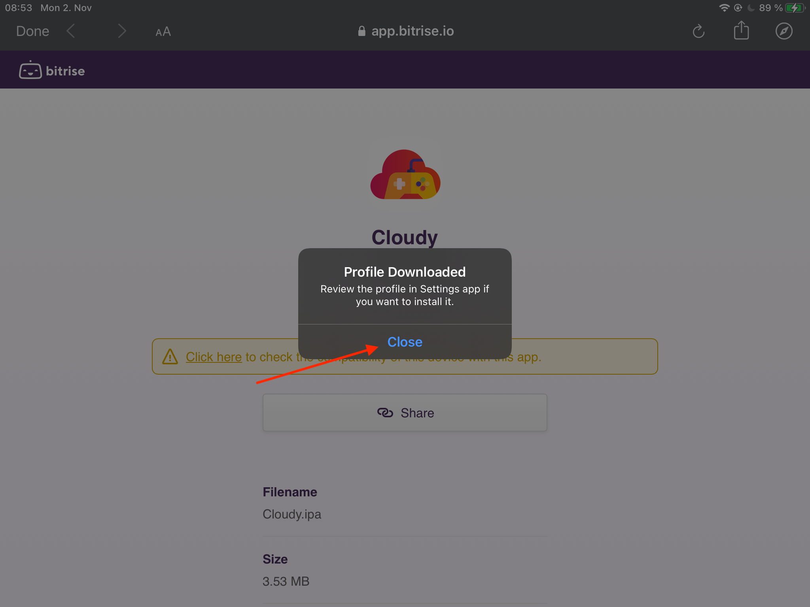

# Ad-Hoc installation guide

Please follow this guide to register your device for [ad-hoc installation](https://developer.apple.com/library/archive/documentation/ToolsLanguages/Conceptual/DevPortalGuide/DistributinganApp/DistributinganApp.html). This is a process that has to be done only once to set everything up. Once the registration is done, you will get updates with just one click.

## Registration
1. Please visit the [discord server](https://discord.gg/9sgTxFx) channel `ad-hoc` and click on the latest ad-hoc release link.

2. Click on `click here` to install the certificate.

3. Click `allow`.

4. Click `Close`. Leave to your home screen and open the iOS system settings. 

5. In the system settings please press on `Profile Downloaded`.

6. Verify that the profile is from "Bitrise" (thic is my [continiuous integration system](https://en.wikipedia.org/wiki/Continuous_integration)) and click `Install`.

7. Again click `Install`.

8. Now Safari will open up automatically and go to the link you initially enterd. (If safari does not open up automatically, please check that you have safari configured as default browser. You can set it back to your preferred browser once the registration is complete)
This time you will see the following screen. Please provide the `UUID` to me. You can do this either directly to me in the [discord server](https://discord.gg/9sgTxFx) to `@mlostek` or message me via [patreon.com](https://www.patreon.com/cloudyApp) website.

## Give us a couple of hours to prepare your build

In this phase you need to wait until the developer publish a new build that contains your registered device. This step will not take longer than 24 hours, promise!

## Install the app.

1. No head back to the [discord server](https://discord.gg/9sgTxFx) channel `ad-hoc` and click on the latest ad-hoc release link.

2. This time you should see an install button on the website.
3. Hit that button, wait for it to be downloaded and enjoy the show.

## Installing update

I will post updates in the [discord server](https://discord.gg/9sgTxFx) channel `ad-hoc`. So whenever there is a post in that channel, click on the provided link and update the app via the same `Install` button as before.

## Troubleshooting

Whenever you have a problem either reach out to me directly via [patreon.com](https://www.patreon.com/cloudyApp) or ask directly in the [discord server](https://discord.gg/9sgTxFx) channel `patreon`.

And most importantly: Have fun!
