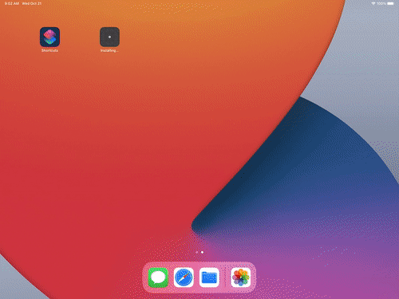
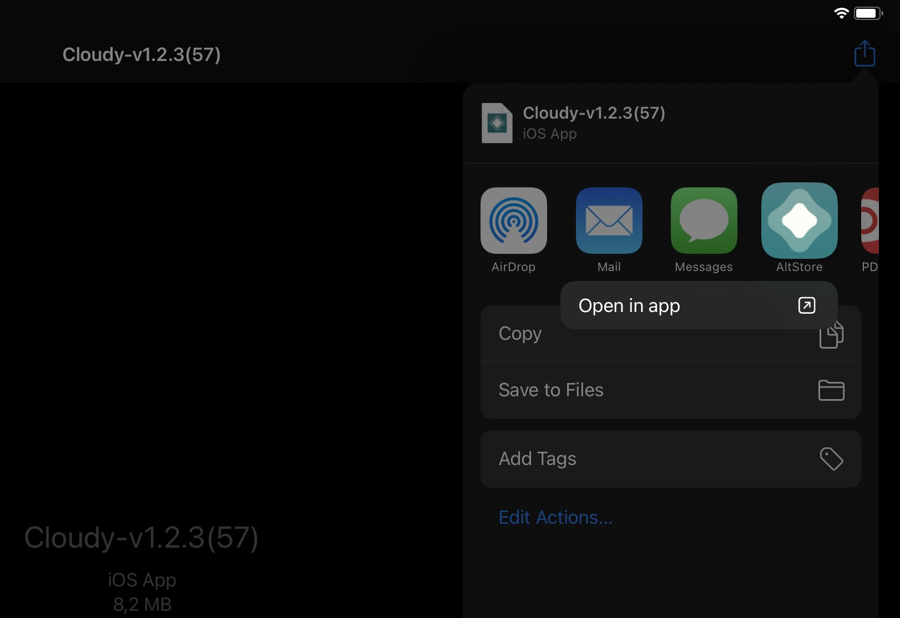
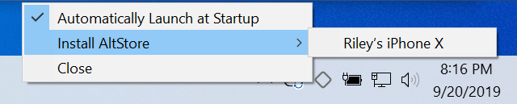
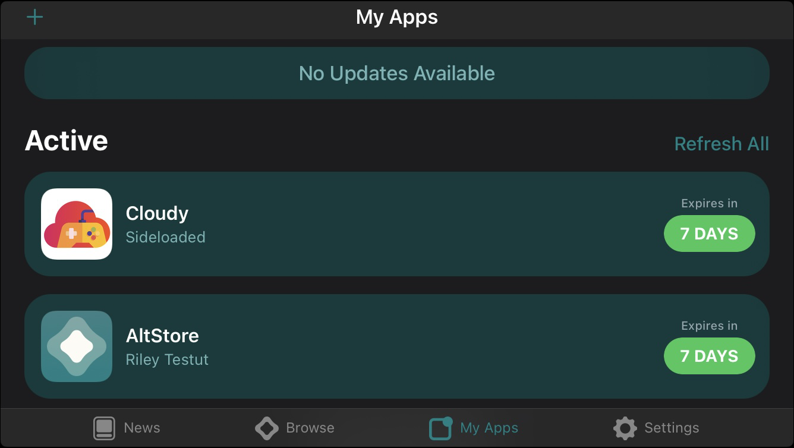
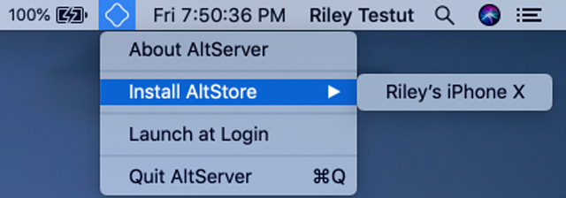

# Cloudy & reKairos 

reKairos |  Cloudy
:-------------------------:|:-------------------------:
 | 

A cloud gaming ready browser for iOS 
and iPadOS.

Table of contents
================
<!--ts-->
- [Table of contents](#table-of-contents)
- [What is Cloudy?](#what-is-cloudy)
- [Support the development](#support-the-development)
	- [Trello development board](#trello-development-board)
- [Features](#features)
	- [Supported](#supported)
	- [In development](#in-development)
	- [Planned for the future](#planned-for-the-future)
- [Ways to get the Cloudy App on your iDevice](#ways-to-get-the-cloudy-app-on-your-idevice)
	- [1. Build it your own](#1-build-it-your-own)
		- [Prerequisites](#prerequisites)
	- [2. Sideload an unsigned .IPA](#2-sideload-an-unsigned-ipa)
		- [Windows](#windows)
		- [Mac](#mac)
- [Video Guides](#video-guides)

- [(FAQ) Frequently asked questions](#faq-frequently-asked-questions)

<!--te-->

# What is Cloudy?

Cloudy is a gaming ready and feature-rich browser for iOS and iPadOS. You can access your supported cloud gaming service(s) directly from the App.

Unlike other browsers, Cloudy is built and designed with cloud gaming in mind and focuses on a minimalistic and seemless full-screen browsing experience.

# Support the development

Cloudy is **for free** and developed by a small team of volunteers.
We appreciate **any** support towards the project in order have more time and resources for the development. <3

Patreon |  Paypal
:-------------------------:|:-------------------------:
 | 

## Trello development board
 
To check the current state of feature development, you can visit our public
Trello development board:

[https://trello.com/b/A2Z965Sf](url)

# Features

## Supported

> **Note**
> :--:
> Currently, only devices with **iOS 14**+ and **iPadOS** 14+ are supported due to *WebKit* restrictions.

- Quick-launching last the used website on startup (e.g. Stadia or GeForce Now)

- Supports Bluetooth® gaming controllers (depending on your OS version) and keyboards in some titles

- Distraction-free fullscreen experience without the status bar

- Soft-locked screen borders for better focus on the content

- Pre-defined **shortcuts**:

	(Type in one of the following strings into the URL-bar to get get to the desired website or use the static bookmarks instead): `stadia` `gfn` `boost`

- If you want to go _crazy_, you can manually specify your **Custom User Agent** to access platform specific web-features

- Reset all cookies and caches (e.g. for troubleshooting)

- Optional inline media playback to access **PiP-Mode** features (picture in picture)

- Custom scaling to remove potential black bars while browsing

- For 3rd-party developers: you can launch this app via **url-scheme**. 

	Example to launch to a specific website:
	> `cloudybrowser://site?url=https://stadia.google.com`

	Example to launch to a service:
	> `cloudybrowser://site?service=geforce`

	Supported services:
	> `stadia`, `luna`, `geforceNow` and `geforceNowBeta`

## In development

- Fixing broken **axis-controls** on GeForce Now

- Proper **touch controls** to imitate the mouse

- Seemless **keyboard input** for games

## Planned for the future

- Borderless **AirPlay 2** integration

- Microphone support

- Integrated iOS/iPadOS Broadcast/Screen Recording feature

- Proper dependency injection

- Better abstraction of modules

- Unit test!

# Ways to get the Cloudy App on your iDevice

## 1. Sideload an unsigned .IPA

Recommended read: [Official AltStore guide for Windows and macOS](https://altstore.io/faq/)

### Windows

1. Make sure you have the downloadable binary version of [iTunes](https://www.apple.com/de/itunes/) and [iCloud](https://support.apple.com/de-de/HT204283) installed on your PC.

> **Do NOT** install the version of iTunes from the Windows 10 App Store, because it is **not compatible** with **AltServer**.

2. Download **AltServer** for Windows 10 from here: https://altstore.io/

3. After installing **AltServer**, connect your device with the PC and move the `.IPA` file onto your device using iTunes to save it somewhere you can navigate to in the Files App.

> Alternatively, you can directly download the [_latest release_](https://github.com/mlostekk/Cloudy/releases) from our GitHub on your device via Safari and save it in the Files App.

4. Open **AltServer**, and it will open in the hidden icon tray located on the right side of your taskbar (the button that looks like an upside arrow, somewhere beside the volume speaker.) and click the **AltServer** icon (it looks like a prism or diamond ◇).

5. Making sure that your iDevice is plugged in, install **AltStore** to through this menu. You will be prompted to login to your (or any other working) iTunes account.

6. Once you login to your iTunes account and click through any remaining dialog boxes, **AltStore** will be installed on your iPhone/iPad.

> **Important**
> :--:
> Leave **AltServer** running in the background or even in the autostart! **AltServer** signs the apps remotely, and will do it whenever it recognizes your iDevice on the network, so make sure that it keeps running so you can continue to use your apps without issue.
>
> To use this feature, you need open iTunes and enable **iTunes Wi-Fi Sync** for your device.

> In order to be able to launch the **AltStore** App, you might have to trust the Signature/Profile in Settings > General > Device Management

7. Open **AltStore** on your device, and navigate to the “My Apps” tab.

8. Press the “`+`” button in the top left corner of the screen.

9. Navigate to the `.IPA` file you dragged into the Files through iTunes, and click on it to install it.

  

### Mac

1. Download **AltServer** for Mac (macOS 10.14.4+) from here: https://altstore.io/

2. After installing **AltServer**, connect your device with the Mac and move the `.IPA` file onto your device using iTunes to save it somewhere you can navigate to in the Files App.

> Alternatively, you can directly download the [_latest release_](https://github.com/mlostekk/Cloudy/releases) from our GitHub Repository directly on your device (via Safari) and save it in the Files App.

3. Open **AltServer**, and it will open in the hidden icon tray located on the right side of your taskbar (the button that looks like an upside arrow, somewhere beside the volume speaker.) and click the **AltServer** icon (it looks like a prism or diamond ◇).

4. Making sure that your iDevice is plugged in, install **AltStore** to through this menu. You will be prompted to login to your (or any other working) iTunes account.

5. Once you login to your iTunes account and click through any remaining dialog boxes, **AltStore** will be installed on your iPhone/iPad.

> **Important**
> :--:
> Leave **AltServer** running in the background or even in the autostart! **AltServer** signs the apps remotely, and will do it whenever it recognizes your iDevice on the network, so make sure that it keeps running so you can continue to use your apps without issue.
>
> To use this feature, you need open iTunes and enable **iTunes Wi-Fi Sync** for your device.

> In order to be able to launch the **AltStore** App, you might have to trust the Signature/Profile in Settings > General > Device Management

6. Open **AltStore** on your device, and navigate to the “My Apps” tab.

7. Press the “`+`” button in the top left corner of the screen.

8. Navigate to the `.IPA` file you dragged into the Files through iTunes, and click on it to install it.

# Video Guides
### Sideloading on macOS

### Introducing Fortnite Mobile with Cloudy

# (FAQ) Frequently asked questions

### Q: Wen eta?
**A:** s0n.
